A story about how we added fast bus scanning, events, and address collision resolution to Modbus.

From the article you will learn why we needed this, what problems we encountered in the process and what we ended up with.

## Task

Wiren Board peripheral devices connect to the RS-485 bus and operate using the Modbus RTU protocol - this is an old industrial data transfer protocol, which is supported in almost all controllers or top-level software.


Controller and some peripherals Wiren Board

But Modbus RTU has disadvantages that stem from its architecture:

- the problem of address collisions - if there are two devices on the bus with the same address, then you need to physically disconnect one of them from the bus and change the address of the second to a free one;
    
- long bus scan - you need to search through all 247 addresses on all possible connection parameters;
    
- a long period of polling one register in a device - if there are many devices on the bus and each has a couple of hundred registers, then depending on the speed and location of the registers, the pause between polling the same register can reach several seconds. This ultimately leads to a slow system response.
    

The first two problems appeared only at the commissioning stage and did not affect the end user, but the long polling period affected the system’s response speed. Therefore, integrators had to fine-tune the system: increase the polling speed, disable polling of unnecessary registers, change polling priorities in our driver, split one bus into several.

But what do you need to respond quickly to in dispatch systems and automation of engineering systems? Basically, on user actions. For example, the user pressed the switch and the light immediately turned on. The maximum time between an action and a reaction to it is very important here - if the system usually responds in 10 ms, but sometimes in 10 s, the user will notice this and start complaining.

And since there are clear problems, we can try to solve them.

## Finding a solution

The first thing that came to mind was to change the interface and protocol of the devices, for example, make devices with a CAN bus.

But this option did not suit us:

- We are good at making devices with Modbus RTU and RS-485 - our development and production processes are tailored to this.
    
- Our customers often use Wiren Board devices with their controllers and Modbus RTU support is available almost everywhere.
    
- Devices from third-party manufacturers are often connected to our controller, and the choice of devices with RS-485 and Modbus RTU is many times wider than with the same CAN.
    

It was probably possible to simultaneously release two lines of devices with different protocols for different market segments, but this is very expensive to develop, manufacture and support.

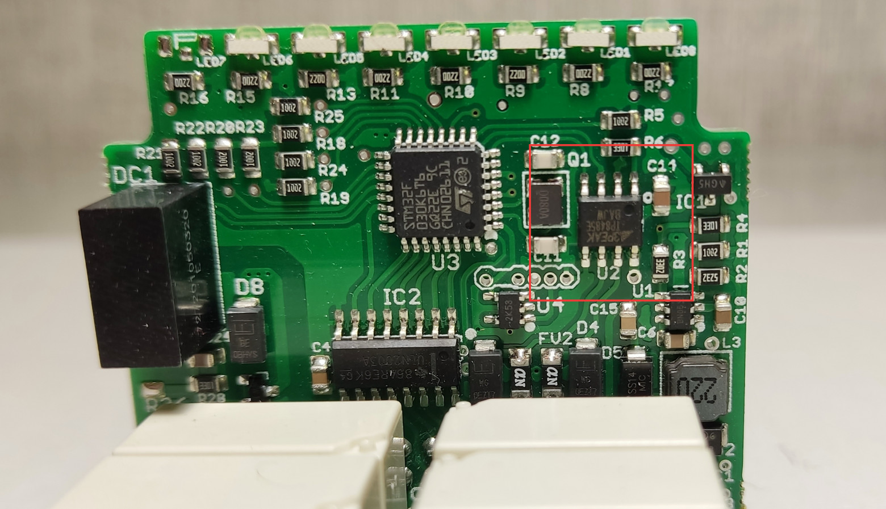

RS-485 transceiver in the WB-MR6C v.2 device

Therefore, it was important for us to preserve our main Modbus RTU protocol, which means the only solution is to develop a protocol extension using the capabilities laid down by the developers of the Modbus protocol.

So, the requirements for the solution:

- software, without modification of circuitry - users of recently released devices will be able to access the extension through a firmware update;
    
- compatible with classic Modbus RTU - our devices must remain Modbus RTU devices and be able to work on the same bus with Modbus devices from other vendors, as well as with controllers that know nothing about the expansion;
    
- simple - this will allow you to easily support it in third-party top-level software, which is important for partners who use our hardware and their software;
    
- open - we do not like closed protocols that tie users to the hardware manufacturer.
    

## Hardware and software for experiments

In the article we will analyze the protocol extension using examples and illustrate it with pictures from a logic analyzer. If you want to see with your own eyes what is happening inside, here is a list of devices and software used in the article:

- A Linux computer with a converter [WB-USB485](https://wirenboard.com/en/product/WB-USB485/), you can take another converter or just a Wiren Board controller. And also the utility [wb-modbus-scanner](https://github.com/wirenboard/wb-modbus-ext-scanner/), which is also a reference implementation of the master for working with the extension. The compiled version for a Linux computer is at the root of the repository.
    
- Counter input module [WB-MCM8](https://wirenboard.com/en/product/WB-MCM8/) and relay [WB-MR6C v.2](https://wirenboard.com/en/product/). It is important that the modules had the latest firmware with event support. If this is not the case, update it using the method described in the documentation.
    
- Logic analyzer, for example, an open source Saleae clone.
    
- PulseView program for Linux or Saleae Logic for Windows. You need to enable the UART protocol decoder. Sampling settings: 10M/2MHz. Commands were issued immediately after the capture was launched - this made it possible to record the master’s request in its entirety, which was not possible with the trigger set for level decline.
    

We connected to the RS-485 transceiver input of one of the slave devices on the bus.

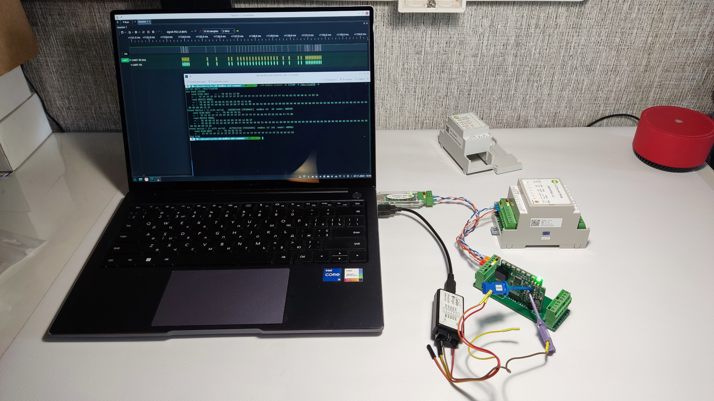
_Stand: laptop with Linux, WB-USB485 converter, logic analyzer and two Wiren Board Modbus devices with support for Fast Modbus expansion_


_More photos of the stand_

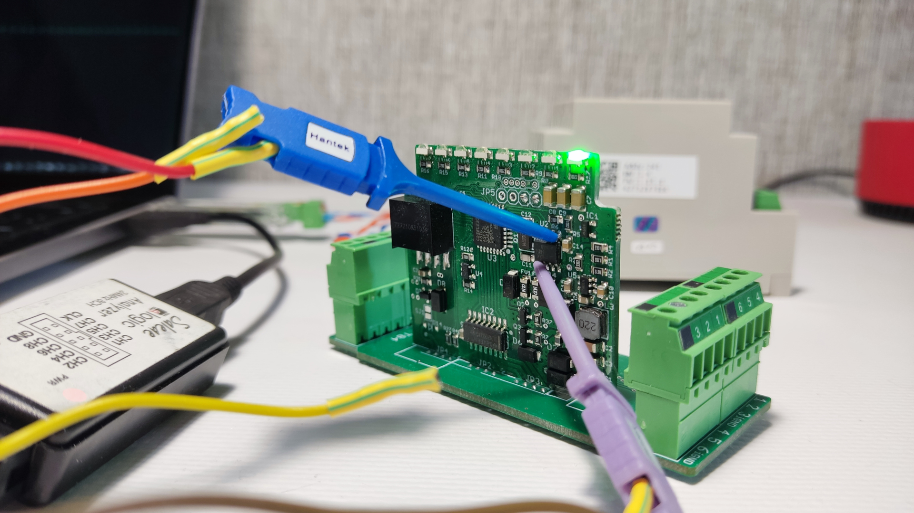
_Connecting a logic analyzer to WB-MCM8_


_Screenshot of scanning process capture_

## Classic Modbus RTU

Before we deal with the extension, let's remember how the classic Modbus RTU works. For a full description of the protocol, read the official documentation.

Modbus is a protocol that is used for data exchange between automation devices.

In Wiren Board devices, data is transmitted over RS-485 serial communication lines using the Modbus RTU protocol, which uses a half-duplex data transmission mode and operates on the “client-server” or “master-slave” principle:

- The master is a client, a controller (PLC);
    
- A slave is a server, an input/output module, or simply a “device.”
    
According to the protocol specification, each slave on the bus has its own unique address from 1 to 247, address 0 is used for broadcasting commands. There are also reserved addresses from 248 to 255, which are not used in the protocol.

The master periodically takes turns polling the slaves, who answer him. The master does not have an address, and the protocol does not provide for the transmission of messages from the slave without a request from the master.

If an error occurs while executing a command, the slave returns its code. If the slave does not respond, the master waits for the set timeout and proceeds to polling the next device.


_Modbus RTU protocol data packet_

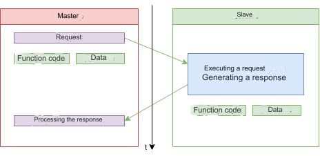

_Modbus transaction completed without errors_

Data exchange in Modbus RTU occurs through registers, there are four types in total. Each type has its own read/write functions.
Here's the markdown table based on your specifications:

| **Type**               | **Size**        |  **Reading** | **Writing**       |
|------------------------|-----------------|-------------|-------------------------------|
| Coils - flag registers | 1 bit            | 0x01                      | 0x05 - one, 0x0F - many   |
| Discrete Inputs - discrete inputs | 1 bit | 0x02                  | —                             |
| Holding Registers - storage registers | 16-bit word | 0x03         | 0x06 - one, 0x10 - many   |
| Input Registers - input registers | 16-bit word | 0x04            | —           |                  |


**The master's request** contains the following information: address of the device on the bus; code of the function to be executed; the address of the first register, the number of registers needed and the checksum.

**The slave's response** contains the following information: device address; function code; number of bytes transferred; the data itself and the checksum (CRC).

#### Example of a classic Modbus request

For example, let's ask a Wiren Board device with address 20 for its modbus address, stored in holding register 128:

0x14 — device address in HEX, 20 in DEC;

0x03 - read one holding register;

0x00 0x80 — address of the first register in HEX, 128 in DEC;

0x00 0x01 - request one register;

0x87 0x27 - checksum.

Slave's response:

0x14 — device address in HEX, 20 in DEC;

0x03 —function that was executed;

0x02 — number of bytes transferred;

0x00 0x14 - data in register, 20 in DEC;

0xB5 0x88 - checksum.


_Example of a request for a Modbus address of a Wiren Board device and a response in classic Modbus RTU_

## Fast Modbus extension

As we saw above, Modbus has a concept of functions. There are many functions, 15 of them are used, and the rest are reserved for hardware manufacturers. Therefore, manufacturers can add functionality missing from standard Modbus simply by using the capabilities inherent in the protocol.


_Functions described in the Modbus protocol specification_

We took the free function **_0x46_**, with which we implemented the capabilities of our extension. To send broadcast commands we use the reserved address **_0xFD_** (253). The checksum is calculated in the same way as in a regular Modbus RTU.

An important point is that if the PLC or SCADA system does not know anything about Fast Modbus, they will communicate with the new “fast” devices in the usual way, with the functions of writing/reading registers. The same is true for Wiren Board controllers - if slave devices do not support Fast Modbus, they will be polled “the old fashioned way”.

Fast Modbus is not a separate mode or a new protocol - it is simply an extension of the standard Modbus RTU protocol that adds new capabilities. If the functions are available, you can use them; if not, everything will work as usual.

On the slave side, the extension requires compliance with timings, and the master is not required to do anything other than support the commands and packet format used in the extension.

The "Fast Modbus" extension is open and [documented](https://github.com/wirenboard/wb-modbus-ext-scanner/blob/main/protocol.md), you can use it in your devices and software. For device developers, we offer a paid framework that implements the protocol part of the classic Modbus RTU with our extension and support for firmware updates via the RS-485 bus. But this is not necessary, you can support our expansion yourself.

Next, we will look at why all this was done: instant search for devices on the bus, fast delivery of register changes from slave to master, and resolution of address collisions on the bus.

## Arbitration

### Physics of the process

Arbitration is a way for slaves to decide for themselves who will now respond to the master’s broadcast request, and also to understand whether there are others willing to respond. This usually works by allowing multiple devices to evaluate who was transmitting what while transmitting different states.

We were inspired by the concept of arbitration in CAN and made our own version via RS-485, taking into account the characteristics of the bus. Both RS-485 and CAN use special microcircuits - transceivers (transmitters) to transmit data to the buses, but they are designed differently.

**In CAN** there are two lines (CANH and CANL), which are stretched by two transistors: CANH can be pulled to power through transistor Q1, and CANL can be pressed to GND through transistor Q2.

When nothing happens on the bus at all, the transistors are closed and the potentials between the lines are equalized through termination resistors. Receivers detect this condition as recessive.

At the moment of transmission of the dominant state, both transistors open and the CANH line is pulled to the power supply, and the CANL line is pressed to GND. Based on the potential difference between the lines, the receivers understand that the bus is in a dominant state.


_Transmission of different states by two transmitters in CAN. Resistors are line resistance_

As you can see from the figure above, if you connect two CAN transmitters together and transmit different states at the same time, the dominant state will be established on the bus. And the one who transmits the recessive will know about it. It turns out that we can simultaneously set different states on the bus using different transmitters.

The arbitration itself in CAN works like this: devices transmit their identifier bit by bit to the bus, setting either a recessive or a dominant state on the bus. The device that puts the dominant state into the bus wins the arbitration, and the recessive one loses. The atomic unit of arbitration here is the bit.

**RS-485** also has two lines (A and B), but the transmitter has a separate pair of transistors to pull lines A and B to power (Q1 and Q2) and a separate pair to push to GND (Q3 and Q4) - this is necessary in order to be able to explicitly transmit logical zero and one to the line, which increases noise immunity.

When nothing happens on the bus at all, that is, the transmitter is turned off and all four transistors inside it are closed, the lines are stretched with failsafe bias resistors. Receivers detect this state as a logical one.

At the moment of transmission, the transmitter is turned on and the transistors pull one of the lines to the power supply, and the other is pressed to GND - the states of the transistors depend on what we are transmitting:

- logical one - Q1 pulls B to power, and Q4 presses A to GND;
    
- logic zero - Q2 pulls A to power, and Q3 pushes B to GND.
    

If you follow andworking on the CAN bus, a natural way to listen to the echo during transmission suggests itself in the hope that one of the states on the RS-485 line will be dominant - but this will not happen.


_Simultaneous transmission of logical 0 and 1 by RS-485 transmitters. Receivers are not indicated on the diagram_

In the picture above, two transmitters are connected to a common RS-485 bus and transmit different states simultaneously:

- in the first transmitter, transistors Q1a and Q4a are open - a logical unit is transmitted to the bus;
    
- in the second transmitter, transistors Q2b and Q3b are open - a logical zero is transmitted to the bus.
    

As we see, current flows from one transmitter to another. Therefore, on a short line, the state will be determined by a stronger transmitter (or how lucky), and on a long line, the potential will be distributed along the bus, and the receivers of each device will hear the states that their transmitters transmit.

This means that we cannot use states 0 and 1 as dominant and recessive when the transmitters are turned on. Therefore, we had no other choice but to accept silence as a recessive state, and the transmission of one of the states as dominant.

In the process of research, we encountered another problem that prevented us from copying the CAN arbitration principle with one-bit atomicity - Linux in the master. Although he does not participate in arbitration, after the request he waits for a response from the slaves. And if the received parcels do not have the USART frame format, then the receiver in Linux will detect ERROR FRAME, and this will complicate working with the bus.

Therefore, we made the transfer of one byte as a dominant state - this allowed us to easily process these states in the master with Linux and relieved the slaves of the need to listen to what others were transmitting to the bus.


_Waveform of arbitration on the RS-485 bus_

**Dominant state** is transmitted with the value _0xFF_ using normal USART transmission and hardware control of the bus driver. _0xFF_ is the maximum number that can be transmitted in one byte and is transmitted as a 1-bit wide pulse during the transmission of the start bit. The rest of the time the package is transmitted with state 1 (IDLE) on the bus. This turned out to be convenient, since if any desynchronization of the slave transmitters occurs, it will be small.

**Recessive state** is silence during the arbitration window, that is, the transmitter is turned off. By doing this, we bypass the hardware limitation of the RS-485 bus, in which it is impossible to simultaneously transmit different states.

**Arbitration window** is the time interval required to receive 12 bits (one UART frame with two stop bits and a parity bit) plus the time reserve for processing the interrupt in the slave microcontroller. The time reserve for interruption is limited below 50 μs and is a multiple of the transmission time of 1 bit.


_Logic analyzer picture of recessive and dominant states on the bus at the time of arbitration_

One identifier bit is transmitted per arbitration window: 0 is a dominant state, and 1 is a recessive state.

If the device must transmit a dominant state, then at the beginning of the arbitration window it sends _0xFF_ to the bus. If a transmission is already in progress on the bus, the device is silent so as not to transmit a message that is out of sync. Such a device cannot lose in this arbitration window. An alien transmission is detected using the BUS BUSY flag, which is in the USART hardware block and is set if an alien start bit is detected on the bus.

If the device must transmit a recessive state, it is silent during the entire arbitration window and listens to the bus. If a byte was received from the bus during the arbitration window, another device transmitted a dominant state and arbitration was lost.

### Arbitration flow

During arbitration, the slave device transmits one bit at a time **arbitration word**, which consists of a priority and a unique identifier.

**Message priority** is 4 bits: 0 (_0b0000_) is the highest, 15 (_0b1111_) is the lowest.

**Unique identifier** depends on the command sent by the master:

- Scan - (28-bit number) the lower 28 bits of the unique serial number, which allows us to ignore modbus address collisions. So that devices with expansion support from different manufacturers can work on the same bus, we distribute serial butmeasures, and for DIY they allocated a separate range - it is indicated in the documentation on Github.
    
- Event polling—modbus address (8-bit number). Devices on the bus are already configured, there are no address collisions, there is no point in wasting time arbitrating by serial numbers.
    

As a result, the arbitration word has a length of 12 bits (4+8) for events or 32 bits (4+28) for scanning.

The identifier bits are transmitted in order, starting with MSB (most significant bit, the most significant bit in a word) and ending with LSB (least significant bit, the least significant bit in a word).

The arbitration word bits are transmitted one at a time during the arbitration window. By the time the transmission of the arbitration word is completed, only one device remains - the winner of the arbitration.

**Zero is transmitted by the dominant state, and one by the recessive** - this means that arbitration is always won by devices with a lower value of the arbitration word. Since 4 priority bits come first, higher priority messages win. If the priority is the same, then the device with the lowest ID wins the arbitration.

#### Why is only 28 bits of the serial number used for scanning?
If you now take the serial number of any of our devices and convert it to the binary number system, you will get a 32-bit number. But as we have already said, we only use the lower 28 bits of the serial, so where do the higher ones go?

We simply discard the most significant four bits of the serial number so that, together with the priority bits, they fit into a 32-bit arbitration word: 28 + 4 = 32. We always have ones in the highest four bits of the serial number, so we do not lose anything from this approach.


_When scanning, the lower 28 bits of the serial number are used device numbers. The highest four are discarded. We specially issue serial numbers so that this does not affect uniqueness._


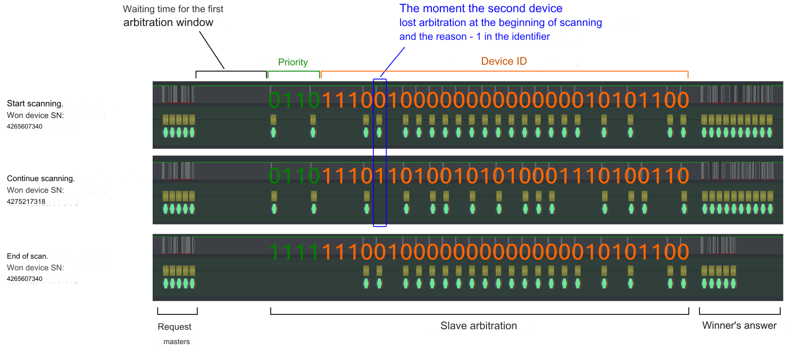

_An example of how arbitration occurs when scanning a bus_

### Timings

To understand the nature of the selected timings, let’s remember what a UART package looks like.

Each data bit, as well as the start and stop bits, have the same duration, which is 1 s/baudrate. To form arbitration windows, we use a separate hardware timer, which is configured so that it increments at the same rate as one bit is transmitted over the UART. Therefore, all our time intervals are multiples of the transmission time of one bit.

**Wait for arbitration to start** is the time between the master request and the first arbitration window. From above, it is limited by the transmission time of 3.5 characters according to the Modbus standard - this is necessary in order to have time on the master to turn off the transmitter and turn on the receiver to receive responses from devices on the bus. The lower limit is 800 μs and is a multiple of the transmission time of a whole bit. The lower limit was selected experimentally with a reasonable margin and is needed so that devices have time to process the request and understand whether they need to participate in arbitration and with what priority.

**The duration of the arbitration** window is equal to the time required to transmit one 12-bit frame (8 data bits, 1 parity bit, 2 stop bits and 1 start bit) plus 50 µs, rounded up to the time of transmission of the whole bit - this is the time , devices need to process the dominant state on the bus and decide whether they continue to arbitrate.

**Timeout for receiving response** is the time that the master waits to understand that there are no devices on the bus that support the Fast Modbus expansion, and to start polling with classic polling. It is calculated as follows: _waiting for the start of arbitration + duration of the arbitration window * number of bits in arbitration._

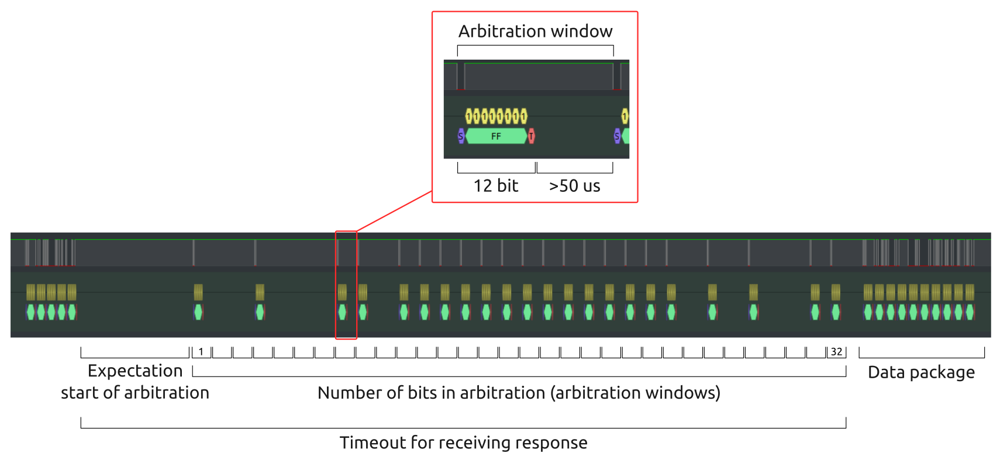

_Creating a timeout for receiving a response_

#### Timeout calculation example
For example, let's calculate the timeout for waiting for a response at a speed of 115200 bps:

Transmission time of 1 bit at a given speed = (1s/115200 bps) * 1000000 = 8.681 µs

* _Waiting for the start of arbitration_ = 3.5 * ( 1 start + 8 data + 1 parity + 2 stop ) = 42 bits * 8.681 µs = 364.602 µs This turned out to be less than the required 800 µs, but you need to wait at least 800 µs, so the timer is set to ROUNDUP(800 / 8.681) = 93 bits. The time will be 93 * 8.681 = 807.333 µs

* _Arbitration window duration_ = (12 bits * 8.681 µs) + ROUNDUP(50 µs / 8.681 µs) * 8.681 µs = 104.172 + 68.681 = 156.258 µs

The number of bits in arbitration during scanning is 32, and in events 12. We get a timeout for receiving a response, which the master is waiting for:

* Scan: 807.333 µs + 156.258 µs * 32 = 5800.256 µs ≈ 5.8 ms

* Events: 807.333 µs + 156.258 µs * 12 = 2675.096 µs ≈ 2.7 ms
## Scan

### Principle

Classic bus scanning in Modbus is a sequential search of all addresses with all connection settings, which takes more than 15 minutes: 247 addresses, 8 speeds, 3 parity options and 2 stop bit options. And if there are devices on the bus with the same addresses, then it becomes impossible to distinguish one from the other.

Using Fast Modbus, iterating over all possible combinations of speed, parity and stop bits on one bus occurs in just ~3.5 seconds. We don’t have to go through all 247 addresses on the bus and wait for a timeout for each request - this saves time.

In general, in our devices it happens like this:

1. The master sends a “Start scanning” broadcast command to the bus.
    
2. Slaves conduct arbitration among themselves - the winner transfers data about himself: serial number and modbus address.
    
3. The master accesses the slave by serial number and reads the model from it.
    
4. After proofreading the model, the master sends the “Continue scanning” command to the bus.
    
5. The slaves conduct arbitration again, the winner of the arbitration sends data about himself, and the master reads the command from him.
    
6. The master again sends the “Continue scanning” command to the bus. And this continues until there are no unscanned devices left on the bus. When this happens, the device with the lowest identifier will receive the “End of scan” message.
    


_In fact, the process looks like this: requests “Who is there?”, arbitration, answers from the winners “I’m here!” and the final “There is no one else”_

If no one responded to the “Start scanning” command, the wizard waits a timeout and switches the communication settings. The timeout is small, there is no need to go through all the addresses, so searching through the settings is very fast.

The following functions are available for scanning:

- 0x01 — start scanning, sends the master;
    
- 0x03 — response to scanning, sent by one of the slaves;
    
- 0x02 — continue scanning, sends the master;
    
- 0x04 - end of scanning, sends one of the slaves.
    

#### Block diagram


Let's take two devices and connect them to the bus; ours have serial numbers:

1. WB-MCM8 - 4265607340 (dec) = 0xFE4000AC
    
2. WB-MR6C v.2 - 4275217318 (dec) = 0xFED2A3A6
    

Let's scan the bus using the wb-modbus-scanner utility:

```
# wb-modbus-scanner -d /dev/ttyRS485-1 -D -b 115200
Serial port: /dev/ttyRS485-1
Use baud 115200
send SCAN INIT -> : FD 46 01 13 90
<- : FF FF FF FF FF FF FF FF FF FF FF FF FF FF FF FF FF FF FF FF FF FF FD 46 03 FE 40 00 AC 14 E8 3A
read DEVICE MODEL
-> : FD 46 08 FE 40 00 AC 03 00 C8 00 14 91 BA
<- : FD 46 09 FE 40 00 AC 03 28 00 57 00 42 00 4D 00 43 00 4D 00 38 00 00 00 00 00 00 00 00 00 00 00 00 00 00 00 00 00 00 00 00 00 00 00 00 00 00 00 00 C5 25
Found device ( 1) with serial 4265607340 [FE4000AC] modbus id: 20 model: WBMCM8
send SCAN NEXT -> : FD 46 02 53 91
<- : FF FF FF FF FF FF FF FF FF FF FF FF FF FF FF FD 60 03 FE D2 A3 A6 F1 B4 49
read DEVICE MODEL
-> : FD 46 08 FE D2 A3 A6 03 00 C8 00 14 8A AF
<- : FD 46 09 FE D2 A3 A6 03 28 00 57 00 42 00 4D 00 52 00 36 00 43 00 00 00 00 00 00 00 00 00 00 00 00 00 00 00 00 00 00 00 00 0 0 00 00 00 00 00 00 00 CE 86
Found device ( 2) with serial 4275217318 [FED2A3A6] modbus id: 241 model: WBMR6C
send SCAN NEXT -> : FD 46 02 53 91
<- : FF FF FF FF FF FF FF FF FF FF FF FF FF FF FF FF FF FF FF FF FD 46 04 D3 93
End SCAN

```

When executing the command, we enabled debugging with the -D parameter so that we could see the bytes being sent and received, which we will discuss below.

### Start scanning

The master sends the command “Start scanning” to the bus, which actually sounds: “Who is there?” Having accepted this command, all slave devices on the bus consider themselves unscanned.

Unscanned devices will try to send a response with the same priority (0b0110), so the device with the lowest serial number will win the arbitration this time.

#### "Start Scan" command

```
FD 46 01 13 90
```

- 0xFD — broadcast address;
    
- 0x46 — command for working with extended functions;
    
- 0x01 — subcommand to start scanning;
    
- 0x13 0x90 — checksum.


Start scanning and arbitration

### Response from the arbitration winner

The slaves conduct arbitration among themselves, which wins the unscanned device with a lower serial number.

It is important here that the device indicates its serial number in the response, that is, in the event of a collision of modbus addresses on the bus, we can see this and change the modbus address by contactingdevice by serial number.

, so the second one loses by serial number")

The priority of both devices is the same (0110), so the second loses by serial number


_Request, arbitration and winner's response_


#### Device response with information about itself
```
FD 46 03 FE 40 00 AC 14 E8 3A
```

- 0xFD — broadcast address;
    
- 0x46 — command for working with extended functions;
    
- 0x03 — scan response subcommand;
    
- 0xFE 0x40 0x00 0xAC — device serial number (big endian);
    
- 0x14 — modbus address of the device;
    
- 0xE8 0x3A — checksum.

### Read registers by serial number

After the master receives a response from the slave who won the arbitration, we can send him an additional request, for example, to subtract the device model.

Here we access the device by serial number, use the standard “read register” command, but package the request in a special package with the function of emulating the standard _0x08_ command.

```
FD 46 08 FE 40 00 AC 03 00 C8 00 14 91 BA
```

- 0xFD — broadcast address;
    
- 0x46 — command for working with extended functions;
    
- 0x08 — subcommand for emulating standard requests;
    
- 0xFE 0x40 0x00 0xAC — serial number of the device we are accessing (big endian);
    
- 0x03 — normal request: standard function code for working with registers;
    
- 0x00 0xC8 0x00 0x14 — request body: read 20 registers (0x14) starting from 200 (0xC8);
    
- 0x91 0xBA - checksum.


_Request for registers with device model and response_

The device that has received the request addressed to it responds with a packet with the _0x09_ function and encloses a standard response to the Modbus command in the body.

Response to a register read request
```
FD 46 09 FE D2 A3 A6 03 28 00 57 00 42 00 4D 00 52 00 36 00 43 00 00 00 00 00 00 00 00 00 00 00 00 00 00 00 00 00 00 00 00 00 00 00 00 00 00 00 00 CE 86
```

- 0xFD — broadcast address;
    
- 0x46 — command for working with extended functions;
    
- 0x09 — subcommand for emulating a response to a standard request;
    
- 0xFE 0x40 0x00 0xAC — serial number of the device we are accessing (big endian);
    
- 0x03 — normal answer: standard function code for working with registers;
    
- 0x28 0x00 0x57 0x00 0x42 0x00 0x4D 0x00 0x43 0x00 0x4D 0x00 0x38 0x00 0x00 0x00 0x00 0x00 0x00 0x00 0x00 0x00 0x00 0x00 0x 00 0x00 0x00 0x00 0x00 0x00 0x00 0x00 0x00 0x00 0x00 0x00 0x00 0x00 0x00 0x00 0x00 — response body;
    
- 0xCE 0x86 - checksum


_Entire master request and slave response_

### Continue scanning

So, the master received a response from the device that won the arbitration and read additional information from it. Next, the wizard sends the command “Continue scanning”, which sounds like “Is there anyone else?”

"Continue scanning" command

```
FD 46 02 53 91
```

-   0xFD — широковещательный адрес;
    
-   0x46 — команда работы с расширенными функциями;
    
-   0x02 — субкоманда продолжения сканирования;
    
-   0x53 0x91 — контрольная сумма.

The devices again play arbitration, which wins the unscanned device with the lowest serial number. The winner of the arbitration replies “I’m here,” and the master reads the model from him.

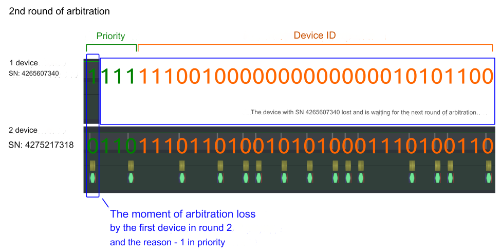

_The arbitration was won by the device with higher priority_

This cycle of "Continue Scan" → "Arbitration" → "Device Response" → "Model Request" → "Device Response" is repeated until all devices on the bus have been scanned.


Continuation of scanning, arbitration and response of another unscanned device

### End scan

An important point is that for each “Continue scanning” request from the master, all devices on the bus participate in arbitration, but messages from _unscanned_ devices have a high priority (0b0110), and messages from _scanned ones have a low priority (_0b1111_). This means that as long as there are still unscanned devices on the bus, their responses always win arbitration: after all, the priority of their messages was higher.

But as soon as all devices on the bus are scanned, the arbitration will win a message from the device that has already been scanned at the next “Continue scanning” command.

This arbitration will win the device with the lowest serial number (based on the remaining bits of the arbitration word). But it doesn't matter which device won this arbitration: all scanned devices tried to send the same "End Scan" message. Having received such a response, the master can be sure that there is not a single unscanned device left on the bus. This approach prevents the master from waiting for a timeout.

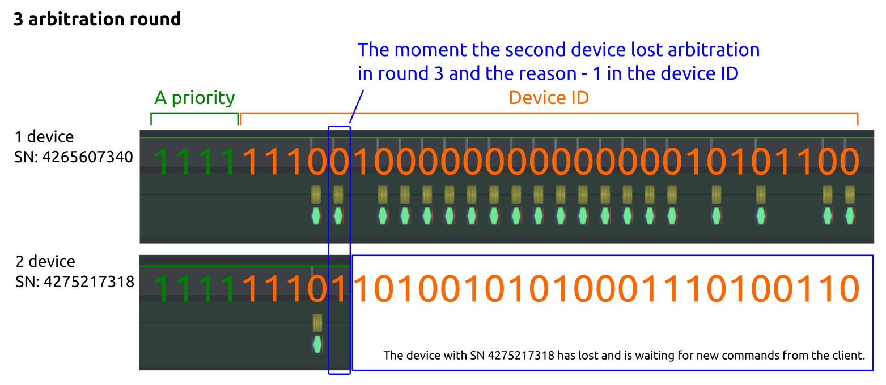

Only scanned devices remained, so messages from one of them won arbitration. The second device was lost by serial number

"End of scan" message

```
<- FD 46 04 D3 93
```

-   0xFD — широковещательный адрес;
    
-   0x46 — команда работы с расширенными функциями;
    
-   0x04 — субкоманда завершения сканирования;
    
-   0xD3 0x93 — контрольная сумма.


_Continuation of scanning, arbitration and the winner's answer - “There is no one else”_

## Events

### Overview

The Fast Modbus extension allows you to quickly poll events that occur in devices without polling each of them in turn. Here, unlike scanning, we work using modbus addresses of devices, so there should be no address collisions on the bus, just like when working with classic Modbus.

In general, it happens like this:

1. The master sends a broadcast command “Does anyone have what?” to the bus.
    
2. Slaves conduct arbitration among themselves based on priority and address - the winner transfers a package with the events he has.
    
3. The master receives a packet with events and sends a packet with the command “Does anyone have what?” to the bus.
    
4. If no one has any events left, the device with the lowest modbus address wins the arbitration and informs the master that there are no more events on the bus.
    
5. The master again sends the command “Does anyone have what?” to the bus. and everything repeats again: arbitration, device response with events.
    

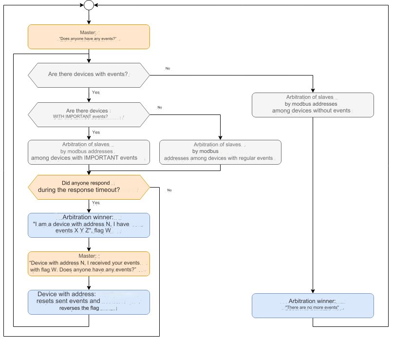

_Block diagram_

The following functions are provided for working with events:

- 0x10 — the master requests events from slaves;
    
- 0x11 — transmission of events from slave to master;
    
- 0x12 — slave response if there are no events on the bus;
    
- 0x18 — setting up events by the master in the slave.
    

There are 4 types of events, similar to register types and a fifth system one:

- 1 — coil;
    
- 2 — discrete;
    
- 3 — holding;
    
- 4 — input;
    
- 15 — system event.
    

By default, in Wiren Board devices, all events except the low priority event “I rebooted” are disabled. Enabling occurs by changing priorities, which affect those 4 message priority bits at the time of arbitration:

- 0 — event is not active;
    
- 1 — low priority event;
    
- 2—high priority event.
    

**Priorities are set for each event**: if a device experiences a priority event, it will enter arbitration with a lower priority bit value and win arbitration first. If there are several such devices, they will win arbitration one by one, starting with the smallest modbus address. Read more about the arbitration procedure in the “Arbitration” section.

The master also has the ability to request events from devices starting from a specific modbus address. This is a protection tool against cases when some device with a small address spams events onto the bus, preventing other devices from winning arbitration.


_Event Request and Response Process_

**To ensure delivery of events** from the device to the master, event acknowledgment is provided. The event packet contains a flag field, which can be 0 or 1. The slaves in each event packet invert this flag relative to the previous one sent by them. Thus, there are no two consecutive packets from the same device with the same flag value. Flags from different devices are not related to each other.

When the master has received a packet with events, it sends another broadcast event request to the bus and puts in a special place the modbus address of the device that needs to confirm the event and the flag from the received packet with the events that it confirms. If there is nothing to confirm, the master simply indicates 0 in the event request packet in the field for the device’s modbus address.

The slave, who saw its modbus address and the correct flag in the event request, resets the sent events and goes to arbitration with new ones. If the flag arrived incorrectly, it adds new events to those already sent, goes to arbitration and, after winning, sends a new packet with the same flag.

When polling events, the master is guided by a standard wait time formula, in which 12 arbitration windows are expected: the transmission of 4 priority bits and 8 modbus address bits.

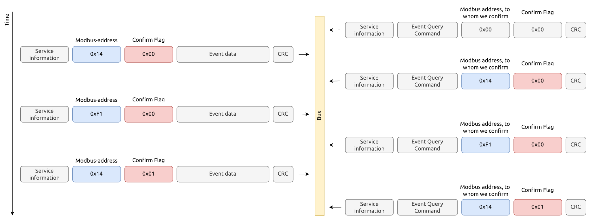
_Event acknowledgment and flag rotation_

### Setting up events on the device

Let's enable sending of the event for changing the short press counter of the eighth input of the WB-MCM8 device with address 20:

```
# wb-modbus-scanner -d /dev/ttyRS485-1 -D -i 20 -r471 -t 4 -c 1 -b 115200
Serial port: /dev/ttyRS485-1
Use baud 115200
    -> : 14 46 18 05 04 01 D7 01 01 69 EA
    <- : 14 46 18 01 01 41 1C

```

Command parameters:

- -D — output debugging, that is, bytes;
    
- -b 115200 — bus speed;
    
- -i 20 — modbus address of the device;
    
- -r471 — 471 device register;
    
- -t 4 — register type, Input;
    
- -c 1 — enable event with priority 1.
    

If you now remove power from the device and apply it again, the event will be disabled; you need to turn it on again,if we need it. In the Wiren Board controller software, events are enabled by the wb-mqtt-serial driver, which turns on the necessary events automatically when it receives the “I rebooted” event from the device.

When setting up events, you need to take into account that not all registers of Wiren Board devices support events - this is done to avoid spam with unimportant events, such as changes in supply voltage. The register numbers for which events are available are described in the documentation for our devices. The driver in the Wiren Board controller has a device template indicating which events need to be enabled, so the user does not need to configure anything.

Of course, when developing your devices using the Fast Modbus extension, you can implement your own behavior. For example, save event settings across reboots and somehow average values that are constantly changing to avoid spam. There are no restrictions at the protocol extension level.

The master’s command sounds like this: “Device with address 20, enable an event for register 471 with priority 1.”

Event Setup Command
```
14 46 18 05 04 01 D7 01 01 69 EA
```

- 0x14 — device address;
    
- 0x46 — control command for allowing event transmission;
    
- 0x18 — subcommand, event settings;
    
- 0x05 — the length of the settings list is 5 bytes;
    
- 0x04 — register type;
    
- 0x01 0xD7 0x01 — register address (big endian);
    
- 0x01 — number of registers in a row;
    
- 0x01 — event priority;
    
- 0x69 0xEA - checksum.
    

In one request, you can enable events of several device registers at once, then the command will sound like this: “Device with address N, enable events in X registers, starting with register Y, and set such and such priorities for each.” 

The device’s response to the command to change event settings sounds like this: “I am a device with address 20, I have enabled events with such and such priorities.”

Device response to event configuration command

```
14 46 18 01 01 41 1C
```

- 0x14 — device address.
    
- 0x46 — command to control the resolution of event transmission.
    
- 0x18 — subcommand for controlling the resolution of transmission of register value change events.
    
- 0x01 — length of the list of setting values.
    
- 0x01 - flags for allowing sending events, we configure one register, we have flag 1 - an event is enabled in one register.
    
- 0x41 0x1C — checksum.
    

In the response, the “register type”, “register address” and “number of registers in a row” fields are omitted, and the permission flags (priorities) are packed into bit masks.


_Event setup command and slave response_


In a similar way, let’s turn on an event for the state of the first output of the second device - relay WB-MR6C v.2 with address 241, register 0 type Coil, priority 2:

```
# wb-modbus-scanner -d /dev/ttyRS485-1 -D -i 241 -r0 -t 1 -c 2 -b 115200
Serial port: /dev/ttyRS485-1
Use baud 115200
-> : F1 46 18 05 01 00 00 01 02 A2 BB
<- : F1 46 18 01 01 0C CA

```

Options:

- -D — output debugging, that is, bytes;
    
- -b 115200 — bus speed;
    
- -i 241 — modbus address of the device;
    
- -r0 — 0 device register;
    
- -t 1 — register type, Coil;
    
- -c 2 — enable an event with priority 2.
    

We discussed the structure of event configuration packages above; we will not repeat it.

After configuration, we will generate events in devices:

- close and open the 8th input of WB-MCM8 - this will increase the input trigger counter;
    
- turn on channel 1 of the WB-MR6C v.2 relay, to do this we close input 1 of this relay.
    

Today, Wiren Board devices do not have an event queue, that is, the device gives the master the fact of the event and the current state of the register (payload), the change of which caused the event. Therefore, to record fast changes, such as pressing a switch, we use counters.

### Event request and device responses

We have a total of two event devices on the bus, so to subtract all the events and get the final “There are no more events”, we need three requests and three rounds of arbitration. Of course, in real life, the master sends requests constantly, the devices constantly play arbitration, and one of them sends their events or a message that there are no events.

But in order to understand the essence of what is happening, we will roughly divide the series of requests and responses into rounds.

#### Round 1

Let's use our utility and request events from devices on the bus. Since we have nothing to confirm, we set the confirmation flag and device address to 0 (_-e 0_):

```
# wb-modbus-scanner -d /dev/ttyRS485-1 -D -e 0 -b 11520
Serial port: /dev/ttyRS485-1
Use baud 115200
send EVENT GET -> : FD 46 10 00 FF 00 00 C8 9A
<- : FF FF FF FF FF FF F1 46 11 00 02 09 01 01 00 00 01 00 0F 00 00 10 64
device: 241 - events: 2 flag: 0 event data len: 009 frame len: 017
Event type: 1 id: 0 [0000] payload: 1 device 241
Event type: 15 id: 0 [0000] payload: 0 device 241
```

Command parameters:

- -D — output debugging, that is, bytes;
    
- -b 115200 — bus speed;
    
- -e — confirm events with flag 0, and if you need to confirm events with flag 1, use -E. The parameter is followed by the address of the device that needs to confirm events. We don’t have those, so we indicate 0.
    

Breakdown, byte by byte is:
```
FD 46 10 00 FF 00 00 C8 9A
```

- 0xFD — broadcast address;
    
- 0x46 — command for working with extended functions;
    
- 0x10 — subcommand requesting events from devices;
    
- 0x00 — the minimum modbus address of the device that will go to arbitration;
    
- 0xFF — the maximum length of the data field with events in the packet that the master expects; according to the standard, the length of the entire packet should not exceed 256 bytes;
    
- 0x00 — address of the device from which the previous event packet was received. Needed to confirm delivery, we have nothing to confirm, so here it’s zero;
    
- 0x00 — flag of the previous received packet to confirm reception;
    
- 0xC8 0x9A — checksum.


After the master has requested events, the devices arbitrate with each other taking into account the priority bits.

**In the first round** our arbitration was won by the WB-MR6C relay with address 241, and WB-MCM8 with address 20 lost. This happened because we configured a high-priority event for the relay, and it managed to occur before the master requested events. That is, the relay won arbitration based on the priority bits, and not on the serial number.

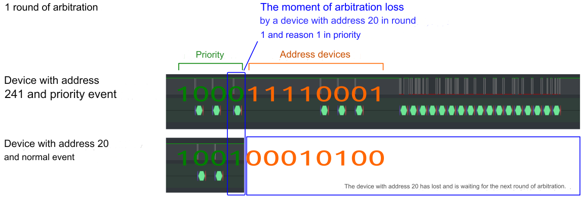

The device with the priority event won the first round of arbitration

Response from device with address 241, byte by byte:
```
F1 46 11 00 02 09 01 01 00 00 01 00 0F 00 00 10 64
```

- 0xF1 - 241, device address;
    
- 0x46 — command for working with extended functions;
    
- 0x11 — subcommand for transmitting events from the device;
    
- 0x00 — flag of this packet to confirm receipt;
    
- 0x02 — number of unreset events;
    
- 0x09 — length of the data field of all events in bytes up to the checksum;
    
- event 1 — 0x01 0x01 0x00 0x00 0x01;
    
- event 2 — 0x00 0x0F 0x00 0x00;
    
- 0x10 0x64 — checksum.
    

One response contains all events that occurred in the device and were not confirmed by the master.

Information about the first event (change in output state) contains _0x01 0x01 0x00 0x00 0x01_:

- 0x01 — length of additional event data (payload);
    
- 0x01 - 1, event type - coil;
    
- 0x00 0x00 — event identifier or register number (big endian);
    
- 0x01 — additional data (payload) (little endian format). That is, the contents of register 0 with type 1.
    

The information in the second event (I rebooted) contains _0x00 0x0F 0x00 0x00_:

- 0x00 — length of additional event data.
    
- 0x0F - 15, event type - system.
    
- 0x00 0x00 — event identifier or register number (big endian).
    
- no additional data.
    

The “I rebooted” event occurred immediately after power was turned on and we did not confirm it - so it came along with the event that we generated ourselves - output 1 is turned on.


#### Round 2

After processing the responseslave, the master again sends a request to the bus, but additionally indicates that the device with address 241 needs to confirm events with flag 0 (-e 241):

```
# wb-modbus-scanner -d /dev/ttyRS485-1 -D -e 241 -b 115200
Serial port: /dev/ttyRS485-1
Use baud 115200
send EVENT GET -> : FD 46 10 00 FF F1 00 8D 0A
<- : FF FF FF FF FF FF FF FF 14 46 11 00 02 0A 02 04 01 D7 01 00 00 0F 00 00 7A DA
device: 20 - events: 2 flag: 0 event data len: 010 frame len: 018
Event type: 4 id: 471 [01D7] payload: 1 device 20
Event type: 15 id: 0 [0000] payload: 0 device 20
```

Event request with confirmation, byte by byte:
```
FD 46 10 00 FF F1 00 8D 0A
```

- 0xFD — broadcast address;
    
- 0x46 — command for working with extended functions;
    
- 0x10 — subcommand for requesting events from devices;
    
- 0x00 — the minimum modbus address of the device that will go to arbitration;
    
- (0xFF - the maximum length of the data field with events in the packet that the master expects; according to the standard, the length of the entire packet should not exceed 256 bytes;
    
- 0xF1 - 241, address of the device from which the previous event packet was received. Needed to confirm delivery of events;
    
- 0x00 — flag of the previous received packet for confirmation;
    
- 0x8D 0x0A — checksum.


The device with address 241 silently confirms the sent events and in the next packet with events will already set the acknowledgment flag to 1. It also enters into arbitration with other devices with a message about the absence of events, which is sent with the lowest priority (4 priority bits equal to 0b1111).

**In the second round** the WB-MCM8 device with address 20 wins, but also because of the priority bits.

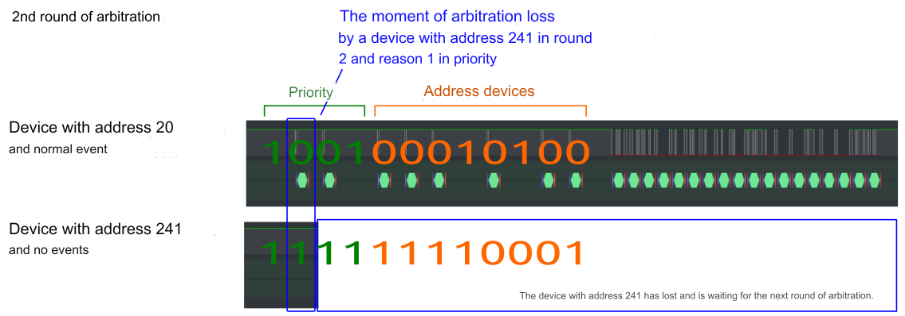

_The second round of arbitration is won by the device with a regular event due to the fact that no one has any more events_

Response from device with address 20, byte by byte:

```
14 46 11 00 02 0A 02 04 01 D7 01 00 00 0F 00 00 7A DA
```

-   0x14 — 20, адрес устройства;
    
-   0x46 — команда работы с расширенными функциями;
    
-   0x11 — субкоманда передачи событий от устройства;
    
-   0x00 — флаг этого пакета для подтверждения получения;
    
-   0x02 — количество не сброшенных событий;
    
-   0x0A — 10, длина поля данных всех событий в байтах до контрольной суммы;
    
-   событие 1 — 0x02 0x04 0x01 0xD7 0x01 0x00 0x00;
    
-   событие 2 — 0x00 0x0F 0x00 0x00;
    
-   0x7A 0xDA — контрольная сумма.
    

В одном ответе содержатся все события, произошедшие в устройстве и не подтверждённые мастером.

Информация о первом событии (изменился счётчик входа) содержит  _0x02 0x04 0x01 0xD7 0x01 0x00_:

-   0x02 — длина дополнительных данных события (payload);
    
-   0x04 — 4, тип события — input;
    
-   0x01 0xD7 — 471, идентификатор события или номер регистра (big endian);
    
-   0x01 0x00 — дополнительные данные (payload) (little endian). То есть содержимое input-регистра 471.
    

Информация о втором событии (Я перезагрузился) содержит  _0x00 0x0F 0x00 0x00_:

-   0x00 — длина дополнительных данных события;
    
-   0x0F — 15, тип события — системное;
    
-   0x00 0x00 — идентификатор события или номер регистра (big endian);
    
-   дополнительных данных нет.
    

Событие «Я перезагрузился» возникло сразу после подачи питания и мы его не подтверждали — поэтому оно пришло вместе с событием, которые мы сгенерировали сами — изменился счётчик входа 1.


#### Round 3

After processing the response from the device, the master again sends a request to the bus, but additionally indicates that the device with address 20 needs to confirm events with flag 0:

```
# wb-modbus-scanner -d /dev/ttyRS485-1 -D -e 20 -b 115200
Serial port: /dev/ttyRS485-1
Use baud 115200
send EVENT GET -> : FD 46 10 00 FF 14 00 C7 9A
<- : FF FF FF FF FF FF FD 46 12 52 5D
NO EVENTS
```

Master request with confirmation explained:
```
FD 46 10 00 FF 14 00 C7 9A
```

-   0xFD — широковещательный адрес;
    
-   0x46 — команда работы с расширенными функциями;
    
-   0x10 — субкоманда запроса событий от устройств;
    
-   0x00 — минимальный modbus-адрес устройства которое выйдет на арбитраж;
    
-   0xFF — максимальная длина поля данных с событиями в пакете, которую ожидает мастер, по стандарту длина всего пакета не должна превышать 256 байт;
    
-   0x14 — 20, адрес устройства, от которого был получен предыдущий пакет с событиями. Нужно для подтверждения доставки событий;
    
-   0x00 — флаг предыдущего полученного пакета для подтверждения;
    
-   0xC7 0x9A — контрольная сумма.


The device with address 20 silently confirms the sent events and in the next packet with events will set the confirmation flag to 1. It also enters into arbitration with other devices with a message about the absence of events.

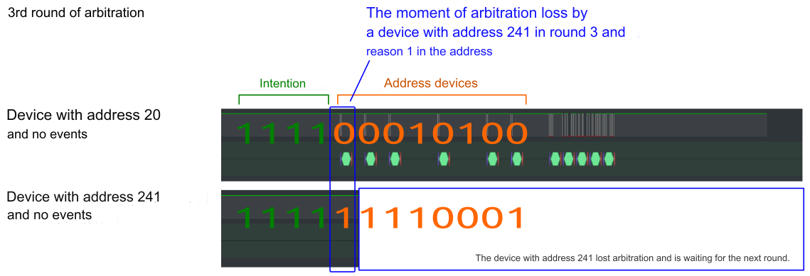

The third round of arbitration is won by the device with the lowest serial number since the message priorities are the same

The response of the device with address 20 is “There are no more events”. Byte by byte:
```
FD 46 12 52 5D
```

- 0xFD — broadcast address;
    
- 0x46 — command for working with extended functions;
    
- 0x12 — subcommand for transmitting a message about the absence of events;
    
- 0x52 0x5D — checksum.


After receiving a message about no events, the master again sends a request for new events, but without confirmation. And so on in a circle. Our wb-mqtt-serial driver sends event requests every 50 ms, allowing for near-instant event delivery.

## Resolving address collisions on the bus

In addition to scanning the bus and working with events, the Fast Modbus extension allows you to access a device by serial number and write the value to a register. This feature can be used to resolve collisions of modbus addresses on the bus - just assign a free modbus address to one of the devices with the same addresses and you're done.


```
# wb-modbus-scanner -d /dev/ttyRS485-1 -D -b 115200 -s 4265607340 -i 200
Serial port: /dev/ttyRS485-1
Use baud 115200
Chande ID for device with serial 4265607340 [FE4000AC] New ID: 200
-> : FD 46 08 FE 40 00 AC 06 00 80 00 C8 DC 35
<- : FD 46 09 FE 40 00 AC 06 00 80 00 C8 8D F0
```

Command to change modbus address by serial number and device response, explained:
```
FD 46 08 FE 40 00 AC 06 00 80 00 C8 DC 35
```

- 0xFD — broadcast address;
    
- 0x46 — command for working with extended functions;
    
- 0x08 — subcommand for emulating standard requests;
    
- 0xFE 0x40 0x00 0xAC — serial number of the device we are accessing (big endian);
    
- 0x06 — normal request: standard code for the register writing function;
    
- 0x00 0x80 0x00 0xC8 — request body: write the number 200 (0x00 0xC8) to register 128 (0x00 0x80);
    
- (2 bytes) 0xDC 0x35 - checksum.

```
FD 46 09 FE 40 00 AC 06 00 80 00 C8 8D F0
```

- 0xFD — broadcast address;
    
- 0x46 — command for working with extended functions;
    
- 0x09 — subcommand for emulating a response to a standard request;
    
- 0xFE 0x40 0x00 0xAC - regular PDU: serial number of the device we are accessing (big endian);
    
- 0x06 - normal response: standard code for the register writing function;
    
- 0x00 0x80 0x00 0xC8 — response body: wrote the number 200 to register 128;
    
- 0x8D 0xF0 - checksum.

-
    

Thus, using the 0x08 standard request emulation function, we can read and write any device registers by accessing it by serial number.


_Example of changing the modbus address by serial number_

## Simultaneous operation of devices with Fast Modbus and classic Modbus RTU

Since the extension is based on classic Modbus, and arbitration between devices occurs only after a request from the master, nothing prevents the master from working on the same bus with “fast” and “slow” devices.

The master simply alternates classic Modbus requests with Fast Modbus broadcast requests. Devices that do not support the extension simply ignore the unfamiliar broadcast address and commands.

To illustrate, we started polling devices through our wb-mqtt-serial driver, which can simultaneously poll devices by regular polling and by events. The driver sends an event request to the bus every 50 ms, reads them, and the rest of the time it works with devices using normal polling. If the “I rebooted” event was received from the device, the driver sendsGives him a package with event settings.


Work on the same device bus without and with support for Fast Modbus

## What's next

The next step is to introduce all expansion capabilities into the controller software, in particular, automatically adding devices on the bus to the driver configuration, setting optimal communication settings and distributing addresses to resolve collisions.

We are also thinking about expanding the capabilities of the peripheral devices themselves, for example, allowing them to exchange messages with each other without a controller - this will allow us to build truly distributed automation systems on top of the classic and reliable RS-485 bus.

We will also help partners implement this extension into their devices and top-level open source software.

## Conclusion

In the article, we talked about our “Fast Modbus” extension, the reasons for its creation, the basic principles and problems solved with its help.

Now our devices can be instantly found on the bus, resolve collisions of modbus addresses and forget about delays when transmitting changes in registers in installations with a large number of devices.

We managed to achieve a good distribution of reaction time to events. Here is an example of our histogram. We connected many relays to one controller on one bus, the script pulled the relay inputs via GPIO and measured the delay from sending a pulse to receiving an update in MQTT. The results were entered into a table and a histogram was constructed.


Histogram of reaction time distribution in Fast Modbus

The extension is implemented at the software level using the capabilities inherent in the original protocol, so we have achieved full compatibility of our devices with the Modbus protocol. If the master interrogating the devices does not know anything about our extension, he will work with them within the framework of classic Modbus.

Fast Modbus is an open and well-documented extension of the Modbus RTU protocol, so you can use it in your devices and software.
